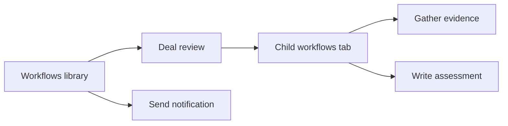

# Child workflows

Accepted design. The first authoring increment implements ownership, contextual creation, the Child workflows tab, navigation, and explicit version selection. Moves, main-library child search, and complete lifecycle operations below remain planned. See [current limits](v1.md).

Interlock currently requires every referenced workflow to occupy a card in the library. A helper used by one procedure therefore competes with the procedures a user actually wants to start. I recommend giving workflows an optional owner and showing owned workflows inside that owner's editor.

## Ownership gives children a home

A **library workflow** has no owner and appears on the main Workflows page. A **child workflow** belongs to exactly one library workflow and appears in that workflow's Child workflows tab. A **Workflow node** invokes a pinned version of another workflow. Ownership and invocation are separate relationships: removing a node does not delete its target.

These are proposed terms. The existing glossary remains unchanged until the design is accepted.

For example, Deal review owns Gather evidence and Write assessment. The library shows Deal review. Its Child workflows tab shows both helpers, including a helper that has not yet been connected to a node.

Use one level of ownership initially. Children cannot own children. A parent may invoke the same child from several Workflow nodes, including nodes inside Batches. A child may invoke a library workflow, but may not invoke another owned child, including a sibling or itself. If two workflows need the same helper, move that helper to the library.

This restriction keeps the meaning of "belongs to this workflow" precise. It also avoids having to explain sibling visibility and moving entire nested collections. If research later demonstrates a need for deeper ownership, the owner relationship can support it after revisiting these rules.

Execution nesting remains independent. Interlock already limits nested Workflow and Batch runs to ten levels. Keep that limit and existing library-to-library invocation behavior. One ownership level does not mean one execution level.

## Store ownership on the workflow record

Add `ownerWorkflowId: string | null` to `Workflow`. Normalize missing values to `null` for existing records. Keep the current ID, draft, draft revision, metadata, versions, and run records.

Ownership belongs beside workflow metadata, outside `WorkflowDefinition`. Raw editing continues to edit only a definition. Workflow nodes continue to identify a target through `workflowId` and `version`; ownership never determines which version runs.

The owner field is the sole source of membership. Do not also store a child-ID array on the parent or a redundant `isChild` flag. The current SQLite document store can persist the field without introducing a separate entity type.

Enforce these rules through the shared server interface:

- An owner must exist and must itself have no owner. A workflow cannot own itself.
- Only the owner may reference an owned workflow in a saved draft or published version.
- Saving still permits incomplete graphs and unresolved version pins. Publishing requires a valid graph and an existing, explicit target version.
- Ownership changes check every saved draft and published version, including archived workflows. An outside historical reference blocks making a library workflow a child.
- Ownership changes and their reference checks commit in one transaction. An expected previous owner detects conflicting moves; draft edits retain their existing revision checks.

Reference validation should be a shared core rule supplied with target metadata and versions. Runtime operations apply that rule and coordinate storage transactions. The UI and MCP explain the same errors; neither implements its own authority rules.

Scope is an authoring and organization rule in a single-user local application. It is not an access-control or script-isolation feature. Direct lookup by ID remains available, and a child can run independently for testing.

## Create a child where it will be used

In Add node, choosing Workflow offers **Create child workflow** and **Use existing workflow**. Existing targets are grouped under **Children of this workflow** and **Library workflows**. Other parents' children never appear. A child editor offers library targets and no child-creation action.

Creating a child asks for its name and offers **Create and open**. The resulting workflow has the current workflow as owner, a blank draft, and no published versions. The operation also adds the invoking node to the parent's draft. Commit both changes atomically with the parent's expected draft revision so a conflict cannot create a detached half-result.

Before this action, make pending parent changes explicit with **Save and create child**. Raw text must be parsed and saved through the existing Raw flow first. Failed validation or a stale draft leaves the editor in place with its edits intact. Do not navigate away and discard the parent graph to open the child.

A new child has no version to pin. Represent that honestly as `version: null` on a draft Workflow node and show **Not published**. Extend draft parsing to accept this state while publication rejects it. Existing positive version numbers keep their meaning. Never use `0`, invent v1 before it exists, or interpret null as "latest" during execution.

The child editor uses the ordinary canvas, settings, and contract editors. Its breadcrumb reads **Workflows / Deal review / Gather evidence**. Keep `/workflows/:workflowId` as its stable address. The breadcrumb and Back action use ownership metadata, so deep links work without navigation history.

After the first publication, offer **Use v1 in Deal review**. This updates the originating node through a revision-checked parent draft edit and returns to the parent. If that node was removed or the draft changed, explain the conflict and let the user select the version after reloading. Publishing a child never silently changes every caller.

The Child workflows tab also offers **New child workflow** without adding a node. Such a child shows **Not used in draft** until the parent references it. This supports creating helpers before deciding where they fit.

## Keep discovery local and predictable

The main Workflows page shows library workflows only. Its active and archived counts use the same scope. Rename the current **All workflows** tab to **Active** so its label remains accurate. A parent's card can show a small child count without displaying the children as cards beside it.

Add **Child workflows** beside Editor and Runs on library workflows. Show each child's name, description, publication status, and use in the parent draft. Include an archived filter. Changing tabs retains the mounted parent editor, following the existing Runs behavior.

Workflow nodes targeting children show the child name, pinned version or unpublished state, and **Open child**. Node settings show **Child of Deal review** or **Library workflow** instead of calling every target a child. Use the existing Mantine controls and theme.

Keep the main search scoped to library workflows by default. An explicit **Include children** option can expose matching helpers with their parent breadcrumb. Selecting a match opens the child directly. Children should not be searchable only by remembering their owner's name, but ordinary browsing must stay quiet.

Opening a child is real navigation. Save or discard parent edits through the existing guard. Editor undo stays local to the current workflow; it never deletes a newly created child as a side effect. Undoing a node addition merely leaves that child listed as unused.

Preserve current run behavior. Global Runs already shows root runs, while invoked children appear in run inspection. A child's Runs tab includes its invocations and direct test runs, with parent-run links where applicable. Direct test runs remain visible globally and identify the owning workflow. The parent's Runs tab continues to list executions of the parent itself.

## Keep publication explicit

Children publish independently. A parent version pins exact child versions, preserving the current execution model. Publishing a parent with an unpublished child reports the affected node and provides **Open child**.

When a newer child version exists, show **v2 available** beside the parent's v1 pin and provide **Use v2**. This edits the parent draft; the user must publish the parent before new runs use that change. Existing parent versions and runs continue using v1.

Do not add automatic publication of all children in the first release. It would need a review of multiple drafts, version allocation, and transaction semantics. The first-use publication sequence is the main usability trade-off of this proposal and should be tested with users.

## Moves preserve identity

**Move to library** clears the owner while preserving IDs, versions, and history. Existing owner references continue to work. The workflow becomes available to other callers and appears in the library.

**Move into workflow** assigns an owner only when the target is a library workflow, the moved workflow owns no children, and no other workflow references it. Check historical versions as well as drafts. A self-reference also blocks this move under the owner-only rule. Explain the exact blocking caller and version instead of offering a move that will fail later.

When an existing helper is shared, offer **Copy as child** from the intended parent's node settings. Create an owned copy and update only that selected draft node through a revision check. Preserve the original and historical pins. The copy begins unpublished, so the new reference is unresolved until the copy is published.

Moving a child between parents is not part of the initial interface. Moving it to the library first makes reuse possible without concealing historical dependencies. A later adoption must pass the same reference checks.

## Lifecycle operations include owned work

Archiving a parent hides it from the active library and makes its children effectively archived without rewriting their individual archive flags. Restoring the parent restores each child's previous state. A child may also be archived individually. Archived targets are omitted from new selections, while already pinned invocations remain executable, matching the current runtime behavior. Direct test starts require both parent and child to be active. Archive does not cancel running work.

Deleting a parent considers the parent and all owned children as one deletion set. Internal references do not block that operation. References from outside the set, outside run ancestry, and active affected runs do block it. After confirmation that names the children and affected history, remove definitions, versions, and associated run trees in one transaction. Shared library dependencies remain intact.

Deleting a child alone retains the existing reference protection. Even a parent version that is no longer the latest can block deletion. Removing the last node from a draft therefore does not imply that the child can be deleted. Offer archive for those cases.

Cloning a parent must copy its children and remap their IDs in the cloned draft. Copy the owned published versions required by those pins, preserving their version numbers under the new workflow IDs, plus each child's current draft. The copied parent starts unpublished and no runs are copied. References to library workflows remain references to the originals. A shallow copy would point into the original parent's children and violate ownership.

Parent export needs a versioned bundle containing the parent draft, owned child drafts, and the child versions required by its pins. Import allocates fresh IDs and remaps ownership and references atomically. Report unresolved library dependencies explicitly. Continue accepting legacy single-definition imports as library workflows. Do not ship a parent export that appears complete while dropping its private dependencies.

## Introduce it without reorganizing existing data

Existing workflows remain library workflows. Do not infer ownership from the number of callers: a workflow used once may still be intentionally reusable. Users can move existing helpers under their parent through the validated operation.

Add explicit list scopes for library workflows, children of an owner, and all workflows. Preserve the existing unfiltered API default for compatibility; the library UI requests the library scope. The app currently resolves editor routes from its loaded workflow list, so filtering only that global collection would break child deep links. Keep resource loading independent from library filtering.

Expose ownership at creation and explicit moves through the shared server interface, CLI, and MCP. Agents need to create children directly instead of creating library clutter that a person must clean up. Keep ownership out of generic raw-definition updates. Before release, update README examples, MCP descriptions, CLI help, architecture, the glossary, and current limits to describe the final behavior.

The initial release should include ownership validation, scoped discovery, contextual creation and navigation, explicit pins, moves, and correct lifecycle operations. Defer arbitrary ownership depth, sibling invocation, automatic publication, and extracting selected graph nodes into a child.

Validate with temporary databases and tests for forbidden cross-owner references, stale creation, unpublished children, old version pins after edits and moves, clone and import remapping, atomic deletion, archived parents, and direct child URLs. Exercise the create-edit-publish-return flow with user research participants. Ask them to find an unused child and to update a parent to a newer child version; those tasks test whether the organization and publication model are understandable.

## Why this model fits Interlock

A hidden flag removes a card but gives the helper no home or lifecycle. Folders organize workflows but do not express that one workflow owns another. Embedding child definitions inside a parent would tie their edits and publication together, but would also require new identity, version, run-inspection, and serialization rules.

An owner field uses Interlock's existing workflow and version model. It has real costs in reference checks and lifecycle operations, which this proposal makes explicit. For the reported problem, that is a smaller and more predictable change than introducing another kind of executable graph.
